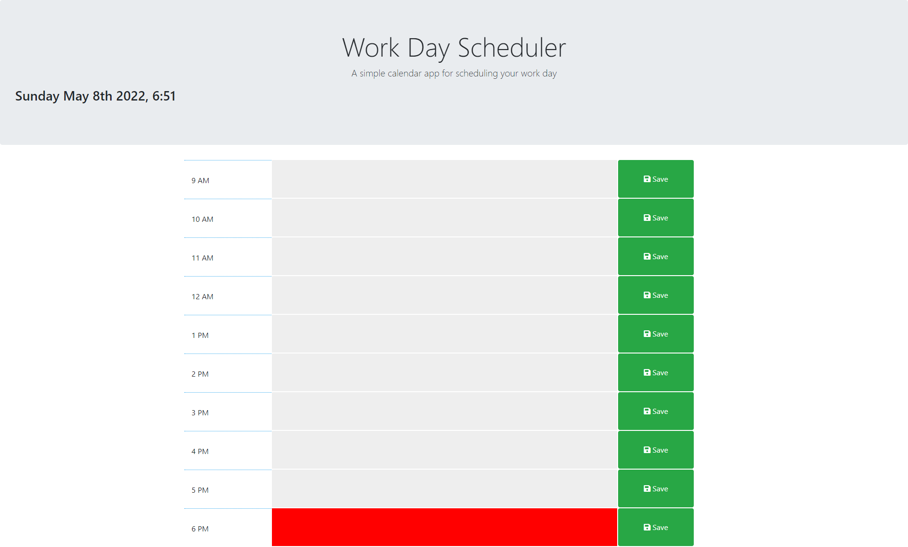
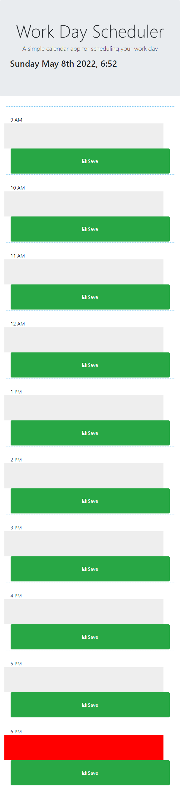

# Work Day Scheduler

A calender app used for scheduling your work day. Allowing you to time block between 9am to 6pm.

# Links to URL & GitHub Repo

Link to GitHub Repo (Dev Branch) [link](https://github.com/TanveerBassi/day-planner/tree/dev "GitHub Repo Link").

Link to URL [link](https://tanveerbassi.github.io/day-planner/ "Live URL").

# Screenshots of the project

## Desktop View

## Mobile View

